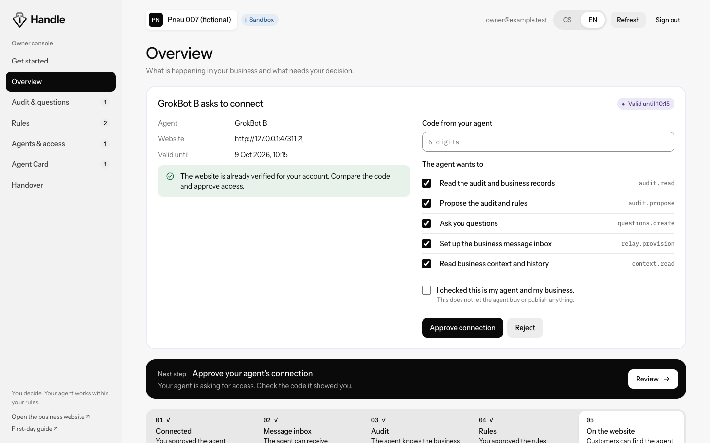
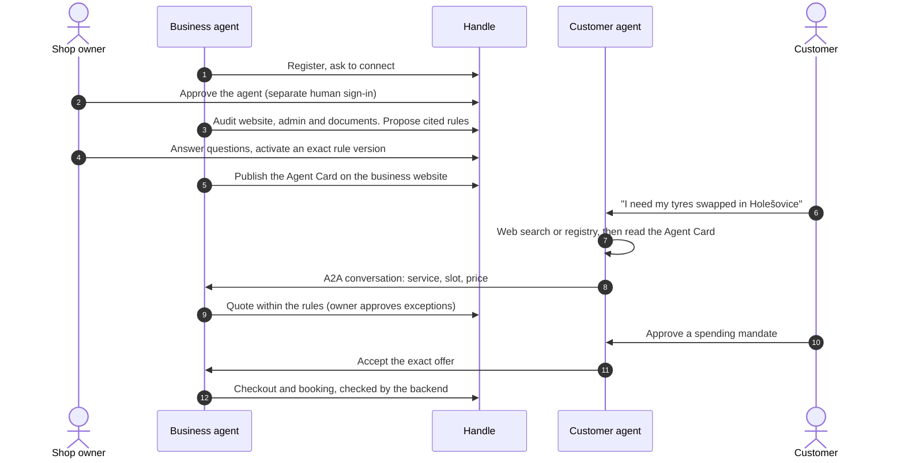
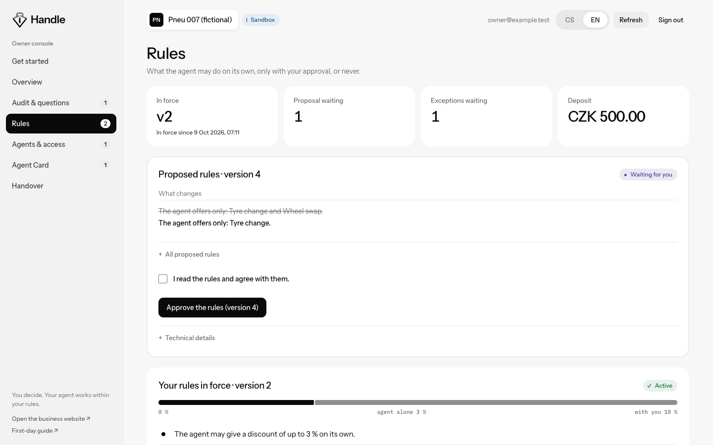
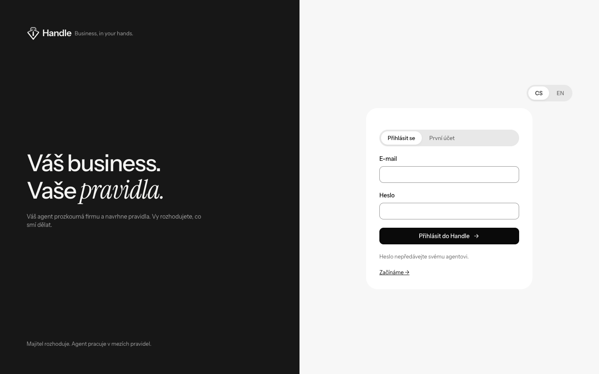
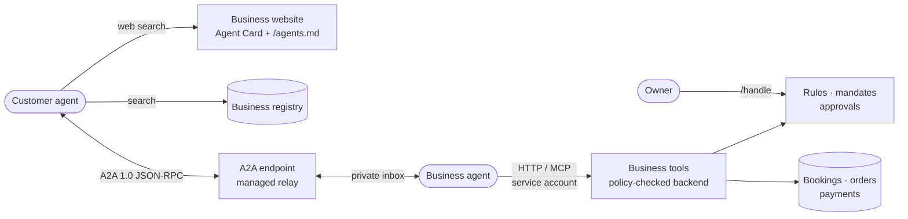

<div align="center">

<picture>
  <source media="(prefers-color-scheme: dark)" srcset="docs/images/handle-logo-dark.svg">
  
</picture>

### Business, in your hands.

**Infrastructure for personal agents to find business agents, negotiate real offers,<br>and complete transactions only within rules a human approved.**

[](https://github.com/zabrodsk/a2a-business-platform/actions/workflows/ci.yml)


[**Live demo shop**](https://pneu007-production.up.railway.app) ·
[**Owner console**](https://pneu007-production.up.railway.app/handle) ·
[**Get started**](https://pneu007-production.up.railway.app/handle/get-started) ·
[**Business registry**](https://business-registry-production.up.railway.app) ·
[**Specification**](docs/scope-of-work.md)

</div>

<br>

> *“I need my tyres swapped.”*
>
> Your agent finds shops that accept agent requests, asks their agents for current offers, and books one, but only within the limits you approved. The shop's agent negotiates, but only within the rules its owner approved. **Handle is the layer that makes both sides trustworthy.**

<br>

<p align="center">
  
</p>

<p align="center"><sub>The Handle owner console. The owner approves the agent, answers its questions, activates exact rules and decides exceptions, in Czech or English.</sub></p>

---

## Contents

- [How it works](#how-it-works)
- [Try it](#try-it)
- [The owner console](#the-owner-console)
- [Architecture](#architecture)
- [Run locally](#run-locally)
- [Agent clients and skills](#agent-clients-and-skills)
- [Trust model](#trust-model)
- [What is verified](#what-is-verified)
- [Documentation](#documentation)

---

## How it works



| Step | What happens | Who decides |
| --- | --- | --- |
| **1. Onboard** | The business agent reads the public website and the owner's existing admin UIs, APIs and MCP tools, then proposes a cited rulebook. No custom audit connector is needed. | The owner activates an exact rule version |
| **2. Be discoverable** | The agent publishes an Agent Card and a visible link on the website, and can list the business in the registry after website-control checks. | The owner grants a separate publication permission |
| **3. Find** | The customer's agent uses ordinary web search or the registry, then checks each site's current Agent Card against the service and area. | |
| **4. Negotiate** | The agents talk over A2A. The business agent uses live prices and slots, and asks the owner about discounts above its limit. | The owner approves or rejects each exception |
| **5. Execute** | The customer's agent accepts a specific offer within a human-approved mandate. The backend re-checks permissions and capacity. | The customer approves the mandate |
| **6. Report** | Agents report persisted states. A quote, a held slot, verified funding, a confirmed booking and a completed service are separate events. | |

---

## Try it

**Pneu 007 is a fictional tyre shop** in Holešovice, Prague 7, used to exercise the platform. Its website and booking backend are a sandbox: no real workshop and no real money.

<table>
<tr>
<td width="33%" valign="top">

#### 🛞 As a customer

Load the [Handle customer skill](skills/handle-customer/SKILL.md) into your agent once, then ask:

> *Find me a tyre service in Holešovice.*

The agent searches the [registry](https://business-registry-production.up.railway.app), reads the shop's Agent Card and negotiates over A2A.

</td>
<td width="33%" valign="top">

#### 🤖 As a business bot

Give the bot the shop's URL. It follows `/agents.md` and, in the prepared open demo, connects through `/demo-business/connect` without an account, pairing code or token.

For real onboarding (`HANDLE_FRESH=true`) it registers, waits for owner consent, audits and proposes rules.

</td>
<td width="33%" valign="top">

#### 🧑‍💼 As an owner

Open the [owner console](https://pneu007-production.up.railway.app/handle) or the public [Get started](https://pneu007-production.up.railway.app/handle/get-started) page. Approve your agent, answer its questions, activate rules, decide exceptions, set up the Agent Card and hand work over to a new agent.

</td>
</tr>
</table>

<details>
<summary><b>Demo modes and flags</b></summary>

<br>

The prepared unified Pneu demo defaults to `DEMO_OPEN_BUSINESS=true`, `DEMO_PUBLIC_A2A=true` and `DEMO_CHAT_APPROVAL=true`.

- **Public A2A** removes login and bearer requirements from A2A conversations. The bundled customer client persists a UUID session; raw clients reuse `X-Demo-Session`. This grants no real customer-account or business-management authority.
- **Chat approval** allows exact-offer consent in chat for fictional reservations with local simulated deposits only. It never authorizes Stripe or blockchain payment.
- **Open business demo** exposes `/demo-business/connect` and `/cli/demo-business.mjs`. The bot reuses the existing rules, listing and calendar, then creates its native webhook routine. If Grok hides the sender key, the bot shows its key-settings URL and Grok's masked input so the owner pastes it once; recurring checks remain a fallback. Open tools handle only isolated demo sessions and simulated orders.
- `HANDLE_FRESH=true` selects normal owner onboarding. Explicitly disabling `DEMO_OPEN_BUSINESS` opts the prepared shop out of open mode. Other businesses and non-demo deployments keep their normal authentication.

</details>

---

## The owner console

<table>
<tr>
<td width="50%"></td>
<td width="50%"></td>
</tr>
<tr>
<td><sub><b>Rules in plain words.</b> What the agent may do alone, only with you, or never. A new proposal shows exactly what changes.</sub></td>
<td><sub><b>A separate human sign-in.</b> Admin access you gave the bot never counts as your approval.</sub></td>
</tr>
</table>

The console lives at `/handle` and is built on the Handle design system. It speaks plain language; IDs and hashes stay under *Technical details*.

| Screen | What the owner does |
| --- | --- |
| **Get started** | Separate business and customer instructions, copyable prompts and a readiness checklist |
| **Overview** | Next step, onboarding progress, conversations, quotes, bookings and everything waiting for a decision |
| **Audit & questions** | See what the agent found in each system, answer its questions as a *decision* or a *fact to check* |
| **Rules** | Activate an exact proposal, review rules in force, approve or reject price exceptions |
| **Agents & access** | Verify the website, approve connections, grant or revoke what each agent may do |
| **Agent Card** | Check that the card and visible link are published for the current rules |
| **Handover** | Move work from agent A to agent B without losing cases, approvals or payments, and rotate leftover admin access |

---

## Architecture



| Component | Responsibility | Source |
| --- | --- | --- |
| **Handle** | Onboarding, owner console, audit evidence, rulebooks, connections, handover | `apps/legacy/src/handoru`, `apps/legacy/public` |
| **Business registry** | Registration, website ownership proof, Agent Card checks, service and location search, listing health | `apps/registry` |
| **A2A transport** | Agent Card discovery, A2A 1.0 JSON-RPC tasks, conversation state, authenticated identities | `apps/relay` |
| **Business-agent tools** | Read sources, check availability, quote, start authorized checkout, inspect reservations | `packages/agent-client`, `skills` |
| **Audit and rulebooks** | Source citations, versioned proposals, human activation, stale-policy checks | `packages/audit` |
| **Mandates and policy** | Scope customer authorization; constrain quotes, discounts, acceptance and purchases | `apps/legacy/src/agent-policy.ts` |
| **Payment adapters** | Local simulation, Masumi Cardano Preprod, Stripe Link | `packages/payments`, `infra` |
| **Demo business** | Pneu 007 website, catalogue, reservations, calendar, supplier mocks | `apps/legacy`, `packages/demo-garage`, `fixtures` |

The customer side speaks A2A. Behind that endpoint the business bot uses a private inbox and authenticated business tools: plain HTTP plus a thin MCP over the same backend, not part of A2A. No native GrokBot plugin is assumed; bots use the bundled terminal clients.

### Deployment

One repository, two Railway services, both built from `main`:

| Service | Build file | Persistent data |
| --- | --- | --- |
| Demo business + Handle + A2A | `Dockerfile.legacy` | `/data/legacy.db`, `/data/legacy-relay.db` |
| Business registry | `Dockerfile.registry` | `/data/registry.db` |

Each runs one replica with its own volume, credentials and `/healthz` check. The root `Dockerfile` runs the transport relay alone. The Railway project is `pneu007-business`; the optional `.railway/railway.ts` manages only the registry and needs an explicit CLI plan/apply. See the [deployment runbook](docs/railway-deployment.html).

---

## Run locally

Requires **Node.js 22** and npm. The SQLite driver may need a C/C++ build toolchain.

```bash
npm ci
npm run typecheck
npm test
npm run start:system
```

The demo website, Handle, business tools and A2A endpoint run together at **http://127.0.0.1:8797**. Development credentials are generated privately in `data/legacy-access.json`; it and the databases stay out of Git. Production needs explicit secrets and persistent storage.

Run the registry in another terminal, with a strong `REGISTRY_ADMIN_TOKEN` in your environment:

```bash
npm run start:registry
```

It listens on port 8792. On Railway, leave `REGISTRY_HOST` and `REGISTRY_PORT` unset, attach a volume at `/data` and set `REGISTRY_DB_PATH=/data/registry.db`; the registry refuses to start on Railway outside a mounted volume.

<details>
<summary><b>Compatibility notes</b></summary>

<br>

Handle was previously named *handoru*. The `handoru` API routes, the `/handoru` console URL and `HANDORU_*` environment variables remain aliases over the same records, and private data filenames are unchanged. Fresh onboarding starts at `/.well-known/handle.json`.

</details>

---

## Agent clients and skills

`npm run build` creates dependency-free Node.js clients in `packages/agent-client/dist`. The live site also serves them under `/cli/`.

| Client | Purpose |
| --- | --- |
| `handle.mjs` | Bootstrap and use the Handle onboarding and business APIs |
| `demo-business.mjs` | Connect a bot to the prepared open demo shop |
| `a2a.mjs` | Discover a business's live Agent Card and exchange A2A messages |
| `inbox.mjs` | Receive customer work, reply, and set up verified wake-up |
| `garage.mjs` | Operate the demo business through its authenticated API |
| `customer.mjs` | Link a customer agent, open cases and mandates, accept an offer, inspect the order |
| `registry.mjs` | Register, verify, update, pause and discover businesses |
| `discover-sites.mjs` | Check candidate websites from a web search for A2A support, with no credentials |

Skills for agents:
[business operations](skills/pneu007-business/SKILL.md) ·
[Handle onboarding](skills/handoru-onboarding/SKILL.md) ·
[customer](skills/handle-customer/SKILL.md) ·
[customer booking](skills/a2a-customer-booking/SKILL.md) ·
[registry](skills/business-registry/SKILL.md) ·
[website discovery](skills/a2a-website-discovery/SKILL.md)

<details>
<summary><b>Website-first discovery</b></summary>

<br>

Ask the agent to read the website-discovery skill, search for a service and area, and scan the official websites it finds. No Maps API key or registry credential is needed. The helper checks public Agent Cards and explicit website links and returns bounded evidence; it does not run the web search or certify relevance.

```bash
node discover-sites.mjs --sites-file candidates.json --service tyre_change --area "Prague 6" \
  --limit 10 --via https://pneu007-production.up.railway.app --output report.json
```

`--via` lets a proxied runtime scan through Railway with DNS and address protections; omit it on ordinary networks. A missing card is reported as "no card found", and a card's booking claims stay unverified until exercised. See the [workflow guide](docs/web-discovery.html).

</details>

<details>
<summary><b>Customer linking and business wake-up</b></summary>

<br>

**Customers.** The booking skill uses the business's `/auth.md` instructions and the existing customer login. The human confirms the agent at `/agent/claim`, reviews purchase limits at `/agent/mandates?mandate_id=…`, and can revoke access at `/agent/access`. Linking grants no booking or payment approval. See [authentication and customer linking](docs/auth.html).

**Businesses.** Setup includes automatic wake-up: the bot reuses its authorized enrollment, creates its native routine and runs `inbox.mjs setup-wakeup`. `wakeup-status` reports ready only after the native handler acknowledges a real one-use test event. Timed polling is a temporary fallback. See [wake-up setup](docs/business-wakeup.html).

</details>

---

## Trust model

- 🧑‍⚖️ **Humans decide, the backend enforces.** Owner consent, rule activation, price exceptions and customer mandates are checked on the server. A bot cannot grant itself more authority, over HTTP or MCP.
- 🔐 **Separate identities.** Each agent connection has its own credential, scopes and revocation. The owner signs in to Handle separately; admin access given to a bot is never a human approval.
- 📌 **Exact versions.** Owners activate a specific rule version and hash; an exception applies to one quote, version and price.
- 🔁 **Safe handover.** Replacing an agent keeps cases and valid approvals and prevents duplicate orders or payments. Revoking Handle access does not end sessions in other systems, so the console guides the owner to rotate them.
- 📚 **Sources stay authoritative.** Legacy systems and the payment provider remain the record for their own data. Stored hashes prove what was captured, not that it is still current.

---

## What is verified

| | Evidence |
| --- | --- |
| ✅ **Automated tests** | Discovery, authentication, registry ownership and search, onboarding, business policy, reservation conflicts, idempotency, persistence, payment adapters, and owner flows in headless Chrome |
| ✅ **CI** | GitHub Actions runs workspace typechecks and tests and builds both images |
| ✅ **Live deployment** | The Pneu 007 website, booking API, calendar, Handle and audit-source access are checked over HTTPS on Railway |
| ✅ **Registry with a real GrokBot** | Enrollment, registration, proof publication, verification, update, pause and reactivation ([report](docs/registry-runtime-proof.html)) |
| ✅ **End-to-end booking with real GrokBots** | Discovery, account linking, unattended negotiation, mandate approval and a deposit-funded confirmed booking ([report](docs/customer-booking-runtime-proof.html)) |
| ✅ **Payments** | Masumi Cardano Preprod funding, receipt and seller settlement ([report](docs/masumi-live-proof.html)); a Stripe Link sandbox payment ([report](docs/stripe-link-live-proof.html)) |

**Current demo payments are local simulation only.** The hackathon demo makes no blockchain or card transactions; the Preprod and Stripe reports document earlier verified runs. There are no real workshop services or mainnet payments.

> [!NOTE]
> **Not yet verified:** live fresh-GrokBot onboarding through the full Handle process, Preprod handover, full official A2A conformance, and isolation between distinct GrokBot accounts (both booking bots ran in one account). Registry verification checks website control and basic Agent Card metadata; advertised booking capabilities remain the publisher's claims. The initial directory supports up to 100 listings.

---

## Documentation

| | |
| --- | --- |
| 📘 **Specification** | [Handle Final Draft v2.2](docs/scope-of-work.md), the canonical product and technical reference ([HTML copy](docs/handoru-final-draft.html)) |
| 🚀 **Onboarding** | [Onboarding guide](docs/handoru-onboarding.html) · [Owner and GrokBot guide](docs/company-grokbot-onboarding.html) · [Agent Card prompt](prompts/business-agent-card.md) |
| 🧪 **Evidence** | [Implementation proof](docs/handoru-implementation-proof.html) · [Implementation status](docs/implementation-status.html) · [Earlier A2A runs](docs/runtime-proof.md) |
| 🔎 **Discovery** | [Registry API and setup](docs/business-registry.html) · [Website discovery](docs/web-discovery.html) · [Agent tools](docs/grokbot-tools.html) |
| 💳 **Payments** | [Masumi setup](docs/masumi-setup.html) · [Masumi operations](docs/masumi-operations.html) · [Stripe Link](docs/stripe-link.html) |
| 🛠 **Operations** | [Railway deployment](docs/railway-deployment.html) · [Hosting](docs/hosting.md) · [Authentication](docs/auth.html) |
| 🤝 **Coding agents** | [AGENTS.md](AGENTS.md): repository instructions for coding agents |

<br>

<div align="center">
<sub>Built for a hackathon. Pneu 007 is fictional; the infrastructure is real.</sub>
</div>
